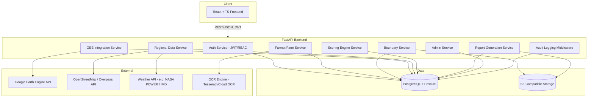
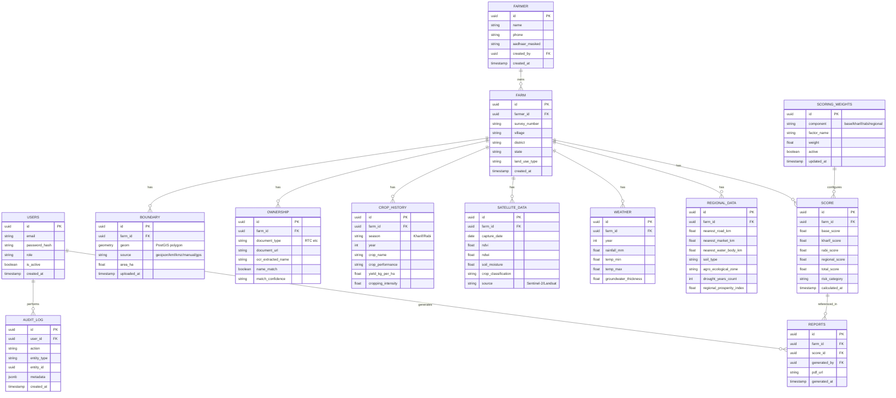

# Farm Credit Risk Scoring Platform — Milestone 1: Architecture

## 1. Product Framing

**What we're building:** An independent farm credit risk scoring platform for agricultural loan underwriting at an NBFC. It ingests farm boundaries, pulls satellite/weather/regional signals from public sources, and produces a transparent, rule-based (and later ML-augmented) risk score with a PDF report for loan officers.

**What we are explicitly NOT doing:** Copying SatSure's scoring formula, weight values, or report IP. We're taking the *category* of inputs any agri-risk platform would use (irrigation, cropping intensity, NDVI, rainfall, regional infrastructure proximity) and defining our own transparent formula with configurable weights owned by the NBFC.

---

## 2. Tech Stack — Decisions & Rationale

| Layer | Choice | Why |
|---|---|---|
| Frontend | React + TypeScript + TailwindCSS | Type safety for a data-heavy UI; Tailwind for fast, consistent styling across dashboard/admin screens |
| Maps | LeafletJS + OpenStreetMap | No vendor lock-in, works well with GeoJSON boundaries, lightweight |
| State/data fetching | React Query | Caching + background refetch for satellite/score data that changes async |
| Backend | Python + FastAPI | Async-first, native Pydantic validation, auto OpenAPI docs, plays well with GEE/ML Python ecosystem |
| ORM/Migrations | SQLAlchemy + Alembic | Mature, explicit migration history — important for an audited lending product |
| Database | PostgreSQL + PostGIS | PostGIS is the only sane choice once you're storing farm boundaries as geometries and running spatial joins (nearest road/market/water body) |
| GIS/Remote Sensing | Google Earth Engine (Sentinel-2, Landsat) | Free/public imagery, server-side compute avoids us hosting petabytes of raster data |
| ML | Scikit-learn + XGBoost | Used later for yield estimation / crop classification refinement, not for the core transparent scoring formula (that stays rule-based and auditable — important for lending explainability) |
| Storage | S3-compatible object storage | Boundary files, satellite image snapshots, generated PDFs |
| Auth | JWT + RBAC | Standard, works statelessly across FastAPI instances |
| PDF | HTML templates + WeasyPrint | Full CSS control, matches the "professional report" look required |
| Charts | Recharts | React-native, works cleanly with Tailwind |

**Key architectural principle:** the **scoring engine is rule-based and its weights live in the database**, not hardcoded. This is what makes it auditable for regulators/credit committees and distinct from a black-box vendor score — echoing the kind of scorecard transparency you already built into the RTS Elixir Scorecard.

---

## 3. High-Level System Architecture



**Flow in one sentence:** Farmer + boundary get uploaded → GEE service computes NDVI/NDWI/soil moisture/crop classification for that geometry → regional service does spatial queries (nearest road/market/water via PostGIS) → scoring engine combines all of it using DB-stored weights → report service renders the PDF → everything is written to the audit log.

---

## 4. Folder Structure

```
farm-credit-platform/
├── backend/
│   ├── app/
│   │   ├── main.py
│   │   ├── core/
│   │   │   ├── config.py
│   │   │   ├── security.py          # JWT, password hashing
│   │   │   └── dependencies.py      # DI containers
│   │   ├── api/
│   │   │   └── v1/
│   │   │       ├── router.py
│   │   │       ├── endpoints/
│   │   │       │   ├── auth.py
│   │   │       │   ├── farmers.py
│   │   │       │   ├── farms.py
│   │   │       │   ├── boundaries.py
│   │   │       │   ├── satellite.py
│   │   │       │   ├── regional.py
│   │   │       │   ├── scoring.py
│   │   │       │   ├── reports.py
│   │   │       │   └── admin.py
│   │   ├── models/                  # SQLAlchemy ORM models
│   │   ├── schemas/                 # Pydantic request/response schemas
│   │   ├── repositories/            # Repository pattern — DB access only
│   │   ├── services/                # Business logic (scoring, GEE calls, PDF gen)
│   │   ├── ml/                      # scikit-learn / XGBoost models + training scripts
│   │   ├── tasks/                   # Background/Celery-style async jobs
│   │   ├── templates/               # WeasyPrint HTML templates for PDF
│   │   └── utils/
│   ├── alembic/
│   │   └── versions/
│   ├── tests/
│   │   ├── unit/
│   │   └── integration/
│   ├── requirements.txt
│   └── Dockerfile
│
├── frontend/
│   ├── src/
│   │   ├── components/
│   │   ├── pages/
│   │   ├── hooks/
│   │   ├── services/                # API client layer
│   │   ├── types/
│   │   ├── context/                 # Auth context, RBAC guards
│   │   └── App.tsx
│   ├── package.json
│   └── Dockerfile
│
├── database/
│   ├── schema.sql
│   └── seed/
│
├── docs/
│   ├── architecture/
│   ├── api/                         # OpenAPI exports
│   └── runbooks/
│
├── scripts/
│   ├── setup_dev_env.sh
│   └── deploy.sh
│
├── tests/
│   └── e2e/
│
├── .github/
│   └── workflows/
│       ├── ci.yml
│       └── deploy.yml
│
├── docker-compose.yml
└── README.md
```

---

## 5. Database Schema (Entities & Key Fields)



**Notes on design choices:**
- `BOUNDARY.geom` uses PostGIS `GEOMETRY(Polygon, 4326)` — enables `ST_Distance`/`ST_DWithin` for all the "nearest X" regional calculations directly in SQL rather than in application code.
- `SCORING_WEIGHTS` is a standalone table (not hardcoded) so credit policy/admin can retune weights without a deploy — same philosophy as your Elixir Scorecard being Excel-configurable.
- `SCORE` stores the full breakdown (base/kharif/rabi/regional), not just the total — needed for the PDF's factor-contribution gauge and for audit/explainability if a loan decision is challenged.
- `AUDIT_LOG.metadata` is `jsonb` to flexibly capture before/after values for weight changes, score recalculations, etc.

---

## 6. Development Roadmap

| Milestone | Scope | Depends on |
|---|---|---|
| M1 — Architecture | This document | — |
| M2 — Database | Alembic migrations for all tables above, PostGIS extension setup, seed data | M1 |
| M3 — Authentication | JWT auth, RBAC roles (Admin / Credit Analyst / Field Officer / Viewer), login UI | M2 |
| M4 — Farm Boundary Module | GeoJSON/KML/KMZ upload + parsing, manual draw (Leaflet), GPS point capture, area calculation | M2, M3 |
| M5 — GEE Integration | Sentinel-2/Landsat NDVI/NDWI/soil moisture/crop classification pipeline, async job to avoid blocking requests | M4 |
| M6 — Scoring Engine | Rule-based formula service reading `SCORING_WEIGHTS`, risk category mapping, admin weight editor | M2, M5 |
| M7 — PDF Report | WeasyPrint templates matching required sections, chart rendering, map snapshot embedding | M6 |
| M8 — Dashboard | Farmer/farm list views, score visualizations, admin panel (weights, users, audit logs) | M3–M7 |
| M9 — Deployment | Dockerization, CI/CD via GitHub Actions, environment configs, deployment runbook | All prior |

Each milestone will ship: models/schemas → repository → service → API endpoint → (frontend piece where applicable) → tests.

---

## 7. Open Decisions for You Before M2

A few things worth pinning down before we touch the DB, since they shape the schema:
1. **Multi-tenancy** — is this single-NBFC (AFPL only) or will it need to support multiple lending institutions on one deployment?
2. **Weather source** — NASA POWER (like your FarmScore app) or IMD/other India-specific source for rainfall/temperature? NASA POWER is easiest to integrate but IMD may be more locally trusted for credit decisions.
3. **OCR for RTC documents** — Tesseract (free, self-hosted, lower accuracy on regional scripts) vs a cloud OCR API (better accuracy, per-call cost, data residency to consider given borrower PII).
